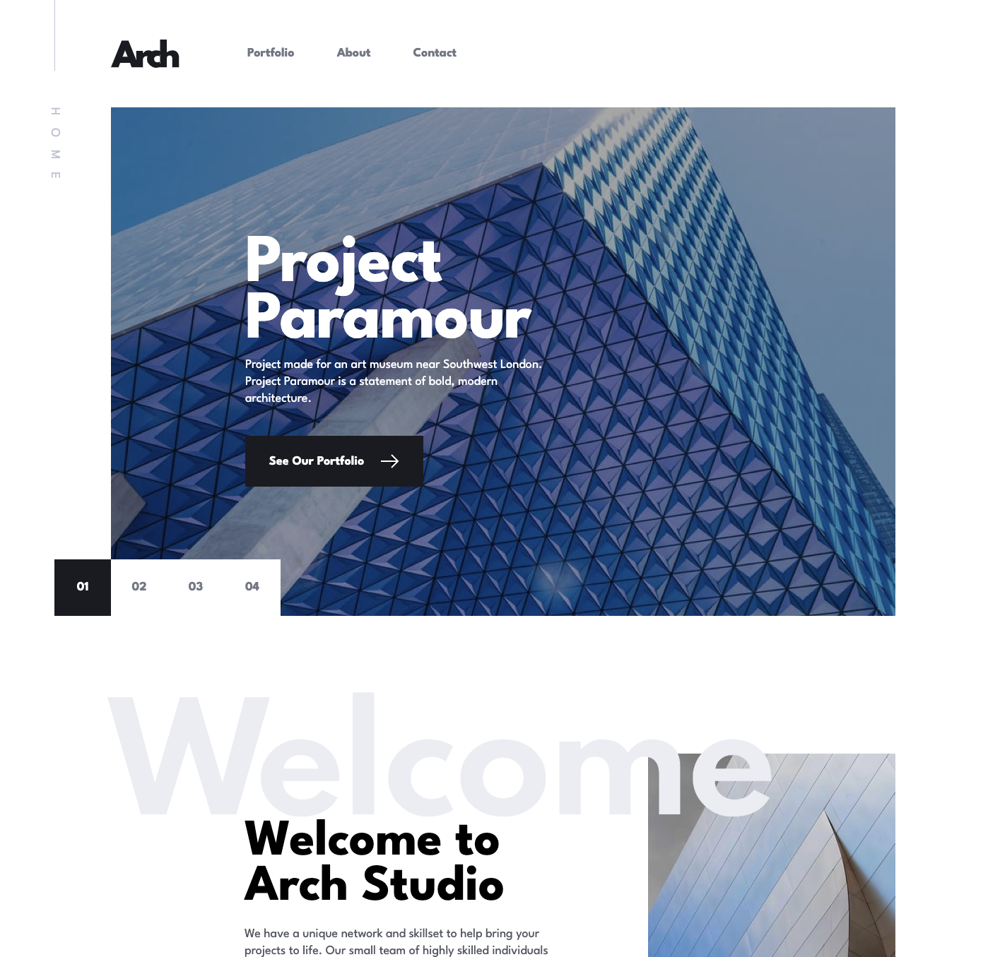

# Frontend Mentor - Designo agency website solution

This is a solution to the Arch Studio multi-page website challenge on Frontend Mentor](https://www.frontendmentor.io/challenges/arch-studio-multipage-website-wNIbOFYR6/hub). Frontend Mentor challenges help you improve your coding skills by building realistic projects. 

## Table of contents

- [Overview](#overview)
  - [The challenge](#the-challenge)
  - [Screenshot](#screenshot)
  - [Links](#links)
- [My process](#my-process)
  - [Built with](#built-with)
  - [What I learned](#what-i-learned)
  - [Continued development](#continued-development)
- [Author](#author)

## Overview

### The challenge

Users should be able to:

1. View the optimal layout for each page depending on their device's screen size
2. See hover states for all interactive elements throughout the site
3. Receive an error message when the contact form is submitted if:
  - The `Name`, `Email Address` or `Your Message` fields are empty should show "Can't be empty"
  - The `Email Address` is not formatted correctly should show "Please use a valid email address"
**Bonus**: View actual locations on the locations page maps (we recommend [Leaflet JS](https://leafletjs.com/) for this)

### Screenshot

### Links

- Solution URL: [Github repository](https://github.com/sariodesign/arch-studio)
- Live Site URL: [Vercel live app](https://sprightly-seahorse-e400d1.netlify.app/)

## My process

### Built with

- Flexbox
- CSS Variables
- Mobile-first workflow
- [Nuxt](https://nuxt.com) - Vue framework
- [Formkit](https://formkit.com/) - For form
- [Leftlet](https://leafletjs.com/) - For map

### What I learned

I improved the knowledges about Nuxt 3 and vue 3

### Continued development

Add some animations
Improve content (maybe with a CMS headless)
Improve validation form

## Author

- Website - [SarioDesign](https://www.sariodesign.dev)
- Frontend Mentor - [@sariodesign](https://www.frontendmentor.io/profile/sariodesign)
- Twitter - [@sariodesign](https://www.twitter.com/sariodesign)
- Linkedin - [@sariodesign](https://www.linkedin.com/in/sariodesign/)
- Github - [@sariodesign](https://github.com/sariodesign)
